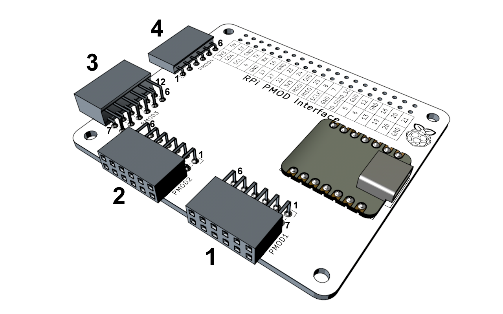
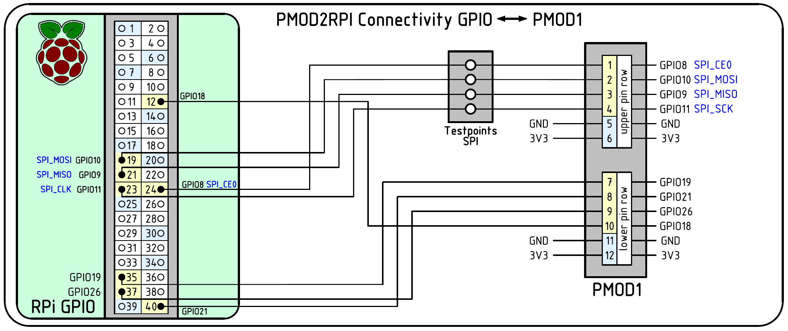
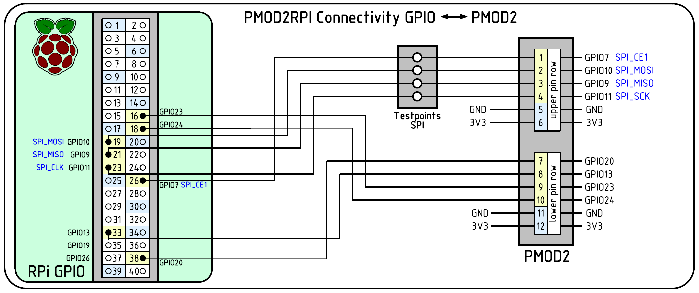
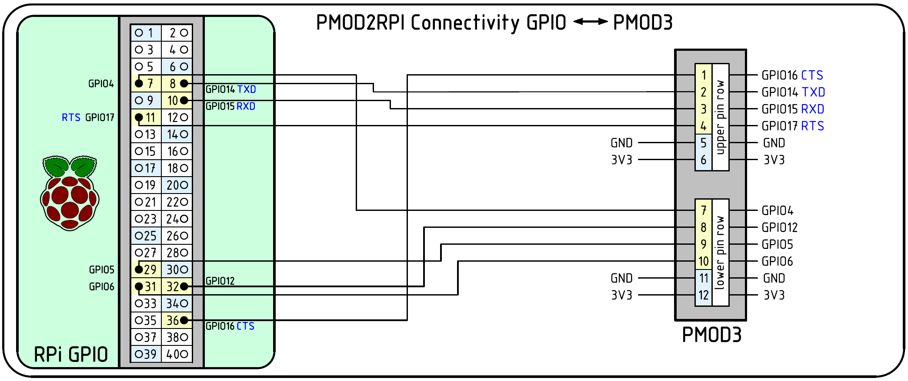

## RPi Pin Assignments

### Raspberry Pi 40-Pin Connector GPIO assignment list

| RPi Pin-# | RPi Pin Name | PMOD#-Pin#      | RPi Pin-# | RPi Pin Name | PMOD#-Pin#     |
|-----------|--------------|-----------------|-----------|--------------|----------------|
| 1         | 3V3          | All (Pin-6)     | 2         | 5V           | -              |
| 3         | GPIO02       | PMOD4-4         | 4         | 5V           | -              |
| 5         | GPIO03       | PMOD4-3         | 6         | GND          | All (GND Pin-5)|
| 7         | GPIO04       | PMOD3-7         | 8         | GPIO14       | PMOD2-1        |
| 9         | GND          | All (GND Pin-5) | 10        | GPIO15       | PMOD3-3        |
| 11        | GPIO17       | PMOD3-4         | 12        | GPIO18       | PMOD1-10       |
| 13        | GPIO27       | PMOD4-2         | 14        | GND          | All (GND Pin-5)|
| 15        | GPIO22       | PMOD4-1         | 16        | GPIO23       | PMOD2-9        |
| 17        | 3V3          | All (Pin-6)     | 18        | GPIO24       | PMOD2-10       |
| 19        | GPIO10       | PMOD1-2, PMOD2-2| 20        | GND          | All (GND Pin-5)|
| 21        | GPIO09       | PMOD1-3, PMOD2-3| 22        | GPIO25       | PMOD2-10       |
| 23        | GPIO11       | PMOD1-4, PMOD2-4| 24        | GPIO08       | PMOD1-1        |
| 25        | GND          | All (GND Pin-5) | 26        | GPIO07       | PMOD2-1        |
| 27        | ID_SD_EEPROM | U1 EEPROM SDA   | 28        | ID_SC_EEPROM | U1 EEPROM SCL  |
| 29        | GPIO05       | PMOD3-9         | 30        | GND          | All (GND Pin-5)|
| 31        | GPIO06       | PMOD3-10        | 32        | GPIO12       | PMOD3-8        |
| 33        | GPIO13       | PMOD2-8         | 34        | GND          | All (GND Pin-5)|
| 35        | GPIO19       | PMOD1-7         | 36        | GPIO16       | PMOD3-1        |
| 37        | GPIO26       | PMOD1-9         | 38        | GPIO20       | PMOD2-7        |
| 39        | GND          | All (GND Pin-5) | 40        | GPIO21       | PMOD1-8        |

## PMOD pinout

### PMOD1 pin assignment list

#### Top Row

| PMOD Pin# | RPi Pin Name | RPi Alternate  | RPi Pin-# | XIAO Pin Name | XIAO-Pin#      |
|-----------|--------------|----------------|-----------|---------------|----------------|
| 1         | GPIO08       | SPI0_CE0       | 24        | D7            | 8              |
| 2         | GPIO10       | SPI0_MOSI      | 19        | D10           | 11             |
| 3         | GPIO09       | SPI0_MISO      | 21        | D9 (D5)       | 10             |
| 4         | GPIO11       | SPI0_CLK       | 23        | D8 (D4)       | 9              |
| 5         | GND          | GND            | 6,9,14... | GND           | 13             |
| 6         | 3V3          | -              | 1,17      | 3V3           | 12             |

#### Bottom Row

| PMOD Pin# | RPi Pin Name | RPi Alternate  | RPi Pin-# | XIAO Pin Name | XIAO-Pin#      |
|-----------|--------------|----------------|-----------|---------------|----------------|
| 7         | GPIO19       | -              | 35        | D3            | 4              |
| 8         | GPIO21       | -              | 40        | D2            | 3              |
| 9         | GPIO26       | -              | 37        | D5 (D9)       | 6 (10)         |
| 10        | GPIO18       | -              | 12        | D4 (D8)       | 5 (9)          |
| 11        | GND          | -              | 6,9,14... | GND           | 13             |
| 12        | 3V3          | -              | 1,17      | 3V3           | 12             |

XIAO pins with alternate pins in () are controlled by the "+I2C Pin" DIP switch setting of SW3.

### PMOD2 pin assignment list

#### Top Row

| PMOD Pin# | RPi Pin Name | RPi Alternate  | RPi Pin-# | XIAO Pin Name | XIAO-Pin#      |
|-----------|--------------|----------------|-----------|---------------|----------------|
| 1         | GPIO07       | SPI0_CE1       | 26        | D7            | 8              |
| 2         | GPIO10       | SPI0_MOSI      | 19        | D10           | 11             |
| 3         | GPIO09       | SPI0_MISO      | 21        | D9 (D5)       | 10             |
| 4         | GPIO11       | SPI0_CLK       | 23        | D8 (D4)       | 9              |
| 5         | GND          | GND            | 6,9,14... | GND           | 13             |
| 6         | 3V3          | -              | 1,17      | 3V3           | 12             |

XIAO pins with alternate pins in () are controlled by the "+I2C Pin" DIP switch setting of SW3.

#### Bottom Row

| PMOD Pin# | RPi Pin Name | RPi Alternate  | RPi Pin-# |
|-----------|--------------|----------------|-----------|
| 7         | GPIO20       | -              | 38        |
| 8         | GPIO13       | -              | 33        |
| 9         | GPIO23       | -              | 16        |
| 10        | GPIO24       | -              | 18        |
| 11        | GND          | -              | 6,9,14... |
| 12        | 3V3          | -              | 1,17      |

The bottom row is not connected to any XIAO pins.

### PMOD3 pin assignment list

#### Top Row

| PMOD Pin# | RPi Pin Name | RPi Alternate  | RPi Pin-# |
|-----------|--------------|----------------|-----------|
| 1         | GPIO16       | CTS            | 36        |
| 2         | GPIO14       | TXD            | 8         |
| 3         | GPIO15       | RXD            | 10        |
| 4         | GPIO17       | RTS            | 11        |
| 5         | GND          | GND            | 6,9,14... |
| 6         | 3V3          | -              | 1,17      |

#### Bottom Row

| PMOD Pin# | RPi Pin Name | RPi Alternate  | RPi Pin-# |
|-----------|--------------|----------------|-----------|
| 7         | GPIO04       | -              | 7         |
| 8         | GPIO12       | -              | 32        |
| 9         | GPIO05       | -              | 29        |
| 10        | GPIO06       | -              | 31        |
| 11        | GND          | -              | 6,9,14... |
| 12        | 3V3          | -              | 1,17      |

### PMOD4 pin assignment list

#### Pin Row

| PMOD Pin# | RPi Pin Name | RPi Alternate  | RPi Pin-# |
|-----------|--------------|----------------|-----------|
| 1         | GPIO22       | -              | 15        |
| 2         | GPIO27       | -              | 13        |
| 3         | GPIO03       | I2C_SCL        | 5         |
| 4         | GPIO02       | I2C_SDA        | 3         |
| 5         | GND          | GND            | 6,9,14... |
| 6         | 3V3          | -              | 1,17      |