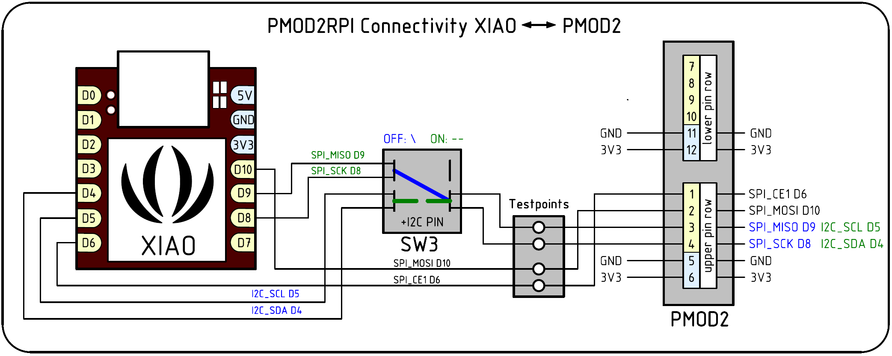

## PMOD2RPI

### Description

PMOD2RPI is a PMOD-compatible Interface Board for the Raspberry Pi B-type GPIO connector. It provides a total of four PMOD connectors to run PMOD-compatible modules on the Raspberry Pi.  This board is compatible to PMOD interface standard v1.3.1 by Digilent Inc. The PMOD (peripheral module interface) standard enables simple plug-in connectivity between FPGA or microcontroller development boards, and a range of input/output modules.

This design is registered under the OSHWA Open Source Hardware Self-Certification:  

 While all connectors provide digital IO, they also double as serial bus connectors for I2C and SPI modules. To aid troubleshooting, a set of Keystone miniature testpins can be fitted to create access for oscilloscope and DMM monitoring. A Seeeduino XIAO footprint has been added to additionally drive two of the four PMOD's, or to communicate with the RPi. The XIAO is optional, and can operate with the board "standalone" if needed.

 

#### I2C /SPI signal switching on PMOD1

The PMOD interface standard v1.3.1 added a new extended I2C connector type 6A, which runs the I2C bus signals over the same pins 3/4 that are already used for SPI. In order to allow both bus types to be used on a single connector, switch SW3 allows to swap the I2C signals between pins 3/4 and 9/10 on PMOD1.

See also http://fpga.fm4dd.com/

### Schematic

### Hardware Versions

| Version | Gerber | Schema |
|---------|--------|--------|
| 1.0     |[20210821-pmod2rpi-gerber-v10.zip](release/v10/20210821-pmod2rpi-gerber-v10.zip) | [20210821-pmod2rpi-schema-v10.pdf](release/v10/20210821-pmod2rpi-schema-v10.pdf) |

 

### Pin Assignments

Pin assigments are listed in the separate [pmod2rpi-pinout.md](pmod2rpi-pinout.md) file.
Below are simplified schematics for the XIAO MCU-specific connectivity.

#### XIAO - PMOD1:

A multi-purpose double-row connector that can used as GPIO Type-1 and Type-1A, SPI Type-2 and Type-2A, or I2C Type-6 or Type-6A, depending on the pin configuration of the XIAO.

#### XIAO - PMOD2:

A double-row connector that can use only the upper row for GPIO Type-1, SPI Type-2, or I2C Type-6 configurations. The lower pins are connected to the Raspberry Pi only.

#### XIAO - Raspberry Pi:

A set of XIAO pins are shared with the Raspberry Pi that can be used to establish GPIO and SPI connections. With bitbanging, I2C is also possible for data exchange between the Pi and the XIAO.

### Example Code

| Platform | Folder | Description |
|----------|--------|-------------|
|Raspberry Pi |[pi-gpiotest](examples/pi-gpiotest)   | simple GPIO test program for digital IO PMODs, such as Digilent's PMOD8LD |
|Raspberry Pi |[pi-tca6424a](https://github.com/fm4dd/pmod-i2c24io/tree/master/examples/pi-tca6424a)   | I2C module driver 'C' program to control the I2C expander module PMOD-I2C24IO connected to PMOD4 |
|Arduino      |[xiao-digital-io](examples/xiao-digital-io)   | Tests digital IO using the Digilent 8-Led PMOD 8LD connected to PMOD1 |
|Arduino      |[xiao-pmod1-24iodemo](https://github.com/fm4dd/pmod-i2c24io/tree/master/examples/xiao-pmod1-24iodemo)   | Creates a lightshow demo by rotating binary patterns over the 24 IO pins, lighting up connected LEDs |

I2C24IO PMOD demos are stored within the PMOD's repo located at [https://github.com/fm4dd/pmod-i2c24io](https://github.com/fm4dd/pmod-i2c24io).

### Board Pictures
I2C24IO PMOD connected to the RPi PMOD Interface board connector PMOD1, running the "xiao-pmod1-i2c24io" example program on the Seeeduino XIAO (Cortex M0) in "standalone" mode:

Raspberry Pi I2C signal measurements on the PMOD2RPI board:

Raspberry Pi operating the I2C24IO-PMOD module connected to PMOD4 on the PMOD2RPI board:

